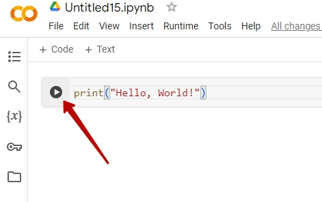

# Старт роботи із середовищем Google.Colab
Python є мовою, на якій сьогодні написані такі математичні бібліотеки, які є найбільш використовані.
Мова програмування Python - є стандартом для всіх спеціалістів по роботі з даними (а саме робота з даними є прикладним використанням математики сьогодні).  
  
Для роботи із даними дуже зручним є середовище Google.Colab - це сервіс Google, який дозволяє як виконувати код на мові програмування Python, так і писати математичний опис із використанням мови верстки LaTex.  
  
Для старту роботи із Google.Colab достатньо мати аккаунт в Google та зайти за адресою сервісу:  https://colab.research.google.com/  

## Створення нового записника  
Для створення нового записника на головній сторінці - натисніть кнопку із написом **"+ New notebook"**  
  
В новому записнику у нас одразу з'являється поле для ввода коду.  
  

## Перший код на Python  
У програмуванні є традиція, починати знайомитися із мовою програмування написанням коду, що виводить фразу "Hello, World!".  
Для цього, необхідно виконати команду **print**  

```
print("Hello, World!")
```

  
  
Для запуску коду необхідно натиснути кнопку поруч із кодом.  
  
Та отримуємо результат  
  


